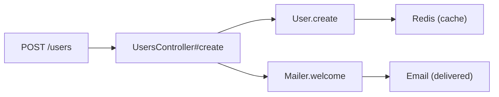
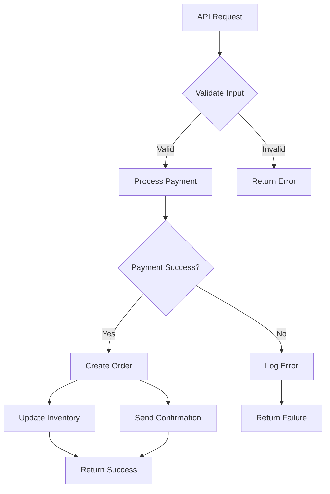
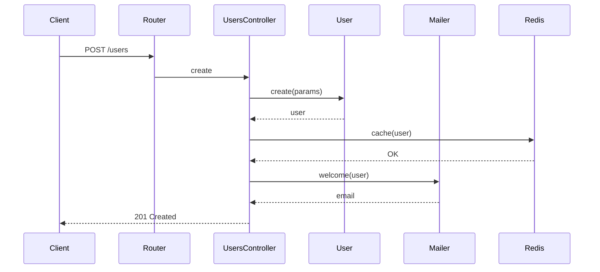
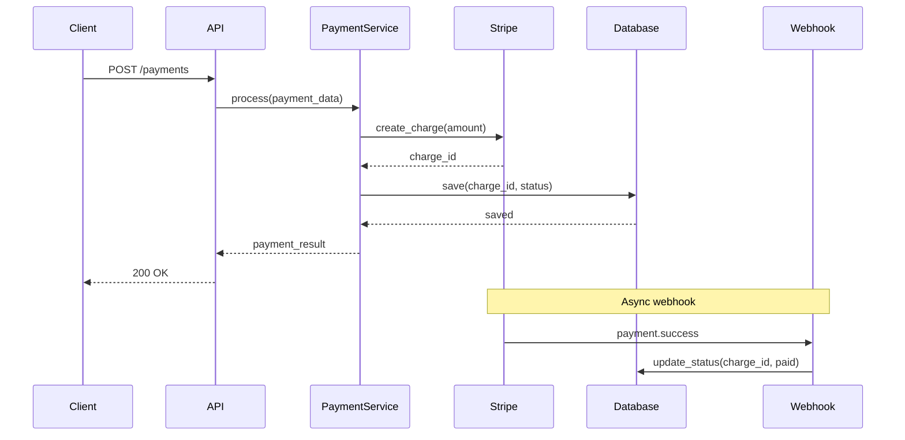
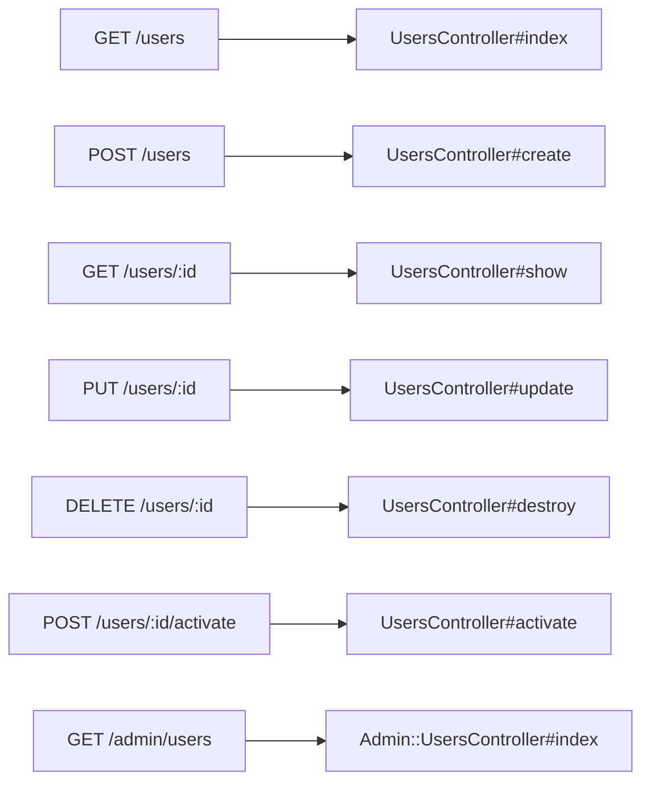
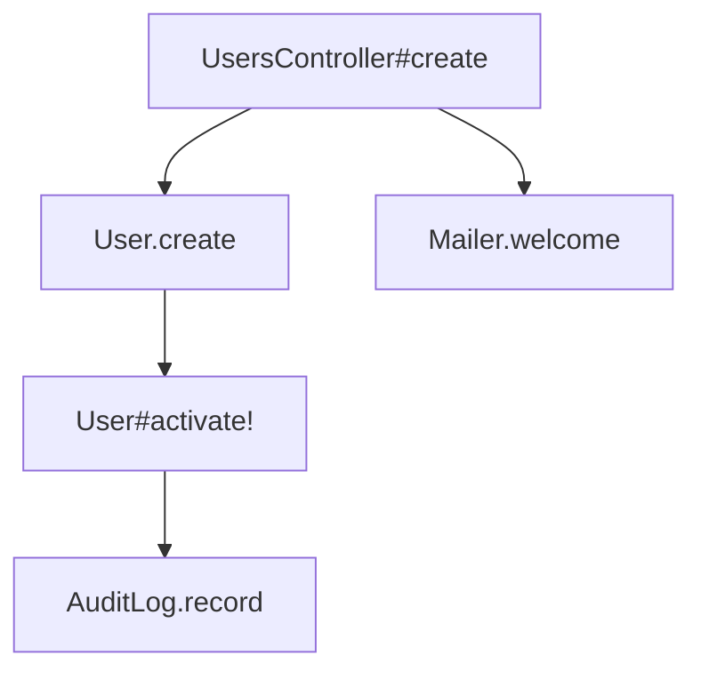

# Feature Showcase

Visual examples of nano-brain's capabilities.

---

## Code Intelligence: Flow Diagrams

nano-brain extracts control-flow graphs and generates Mermaid flowcharts.

### Example: Rails Controller Flow



**What this shows:**
- Entry point: HTTP request to `POST /users`
- Handler: `UsersController#create`
- Downstream calls: `User.create`, `Mailer.welcome`
- External dependencies: Redis cache, Email delivery

### Example: Complex Service Flow



**What this shows:**
- Decision nodes (diamonds) for branching logic
- Parallel paths (F → H and F → I)
- Error handling (G → K)

---

## Code Intelligence: Sequence Diagrams

nano-brain generates Mermaid sequence diagrams from flow data.

### Example: User Registration Flow



**What this shows:**
- Request/response flow across components
- Async operations (Redis cache, Mailer)
- Return values at each step

### Example: Payment Processing Flow



**What this shows:**
- Synchronous request flow
- Async webhook handling
- Database operations
- External service integration (Stripe)

---

## Benchmark Results

### Agent Memory Comparison

We benchmarked nano-brain against other memory tools using 60 domain-specific queries across 3 workspaces.

| Metric | nano-brain | LlamaIndex | Qdrant/Mem0 |
|--------|------------|------------|-------------|
| **P@5** | **0.749** | 0.55 | 0.27 |
| **MRR** | **0.967** | — | — |
| **Latency** | 42ms | — | — |

**What this means:**
- **P@5 (Precision at 5)** — 74.9% of the time, nano-brain's top 5 results contain relevant content
- **MRR (Mean Reciprocal Rank)** — 96.7% of the time, the first result is relevant
- **Latency** — Average 42ms per query

### Per-Workspace Results

| Workspace | Queries | Avg P@5 | Avg MRR | Avg Results |
|-----------|---------|---------|---------|-------------|
| gaming-platform (gaming) | 20 | 0.783 | 1.000 | 4.8 |
| nano-brain (Go) | 20 | 0.800 | 1.000 | 4.8 |
| rails-project (Rails) | 20 | 0.662 | 0.900 | 3.3 |

**Key insight:** nano-brain performs consistently across different codebases (gaming platform, Go codebase, Rails app).

### Search Quality Improvements

#### BM25 OR Fallback

When BM25 AND mode returns 0 results, nano-brain retries with OR semantics:

```
Query: "Explain the order lifecycle"
AND mode: 0 results (requires ALL words)
OR mode: 10 results (requires ANY word)
```

This ensures natural language queries still return results even when some words don't exist in the index.

#### Incoming Edges Symbol Fallback

When looking up incoming edges by `target_node`, nano-brain falls back to symbol name matching:

```sql
-- Primary: exact match
WHERE target_node = 'UsersController#create'

-- Fallback: symbol name match  
WHERE split_part(target_node, '::', 2) = 'create'
```

---

## Ruby/Rails Support

### Rails Route Extraction

nano-brain extracts Rails routes and generates flow diagrams:

```ruby
# config/routes.rb
resources :users do
  member do
    post :activate
  end
end

namespace :admin do
  resources :users
end
```

Generated flow:



### Cross-File Resolution

nano-brain resolves cross-file calls in Ruby:

```ruby
# app/controllers/users_controller.rb
class UsersController < ApplicationController
  def create
    @user = User.create(user_params)
    Mailer.welcome(@user).deliver_later
  end
end

# app/models/user.rb
class User < ApplicationRecord
  def activate!
    update(active: true)
    AuditLog.record(self, :activated)
  end
end
```

Generated graph:



---

## MCP Tools in Action

### Query Tool

```json
{
  "name": "memory_query",
  "arguments": {
    "workspace": "abc123...",
    "query": "how does authentication work",
    "max_results": 5
  }
}
```

Returns ranked results with snippets, scores, and metadata.

### Impact Analysis Tool

```json
{
  "name": "memory_impact",
  "arguments": {
    "workspace": "abc123...",
    "node": "src/auth/login.ts",
    "max_depth": 2
  }
}
```

Returns all files/functions that would be affected by changes to `login.ts`.

### Call Chain Trace Tool

```json
{
  "name": "memory_trace",
  "arguments": {
    "workspace": "abc123...",
    "node": "cmd/server/main.go::main",
    "max_depth": 5
  }
}
```

Returns the full call chain from `main()` through all downstream functions.

---

## Performance

### Search Latency

| Operation | p50 | p95 | p99 |
|-----------|-----|-----|-----|
| BM25 search | 8ms | 25ms | 50ms |
| Vector search | 12ms | 35ms | 80ms |
| Hybrid search | 15ms | 45ms | 100ms |
| Flow diagram | 20ms | 60ms | 150ms |

### Indexing Speed

| File Type | Speed | Notes |
|-----------|-------|-------|
| JavaScript/TypeScript | 500 files/s | Tree-sitter extraction |
| Python | 400 files/s | Tree-sitter extraction |
| Ruby | 300 files/s | Tree-sitter extraction |
| Go | 600 files/s | Regex-based extraction |
| Markdown | 1000 files/s | Heading-aware chunking |

### Memory Usage

| Component | Memory | Notes |
|-----------|--------|-------|
| Server (idle) | 50 MB | Go binary |
| Server (10K docs) | 150 MB | With embedding cache |
| PostgreSQL | 500 MB | For 10K docs with vectors |
| Total | 700 MB | Complete setup |
