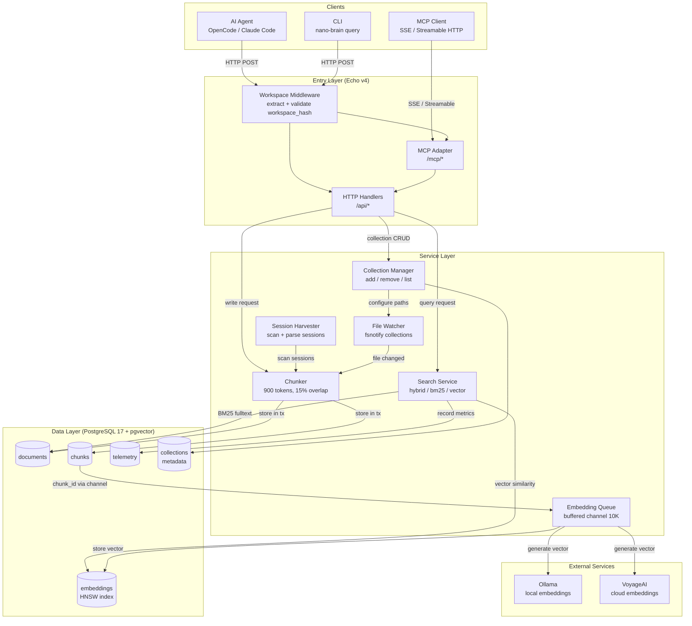

# nano-brain v2 — System Architecture Diagram



## Flow Summary

### ① Query (Read Path)

```
Client → Middleware (validate workspace) → Search Service
  ├── BM25 fulltext search (tsvector) → documents table
  ├── Vector similarity (pgvector) → embeddings table
  └── RRF merge → response + telemetry recording
```

### ② Ingestion (Write Path)

```
Source (harvest / watcher / API write)
  → Chunker (split 900 tokens, 15% overlap)
  → PostgreSQL transaction (documents + chunks)
  → Embedding queue (async buffered channel 10K)
  → Ollama or VoyageAI → embeddings table
```

### ③ Collection Management

```
CLI / API → Collection Manager → metadata table + configure watcher paths
```

### Key Design Points

- **Every request** passes through Workspace Middleware — no workspace = HTTP 400
- **Query** runs BM25 + Vector in **parallel**, merged via Reciprocal Rank Fusion (RRF)
- **Ingestion** is synchronous (chunk + store) but **embedding is async** via buffered channel
- **3 background goroutines** (harvester, watcher, embed queue) managed by errgroup + context
- **All SQL queries** include `WHERE workspace_hash = $1` — enforced at architecture level
